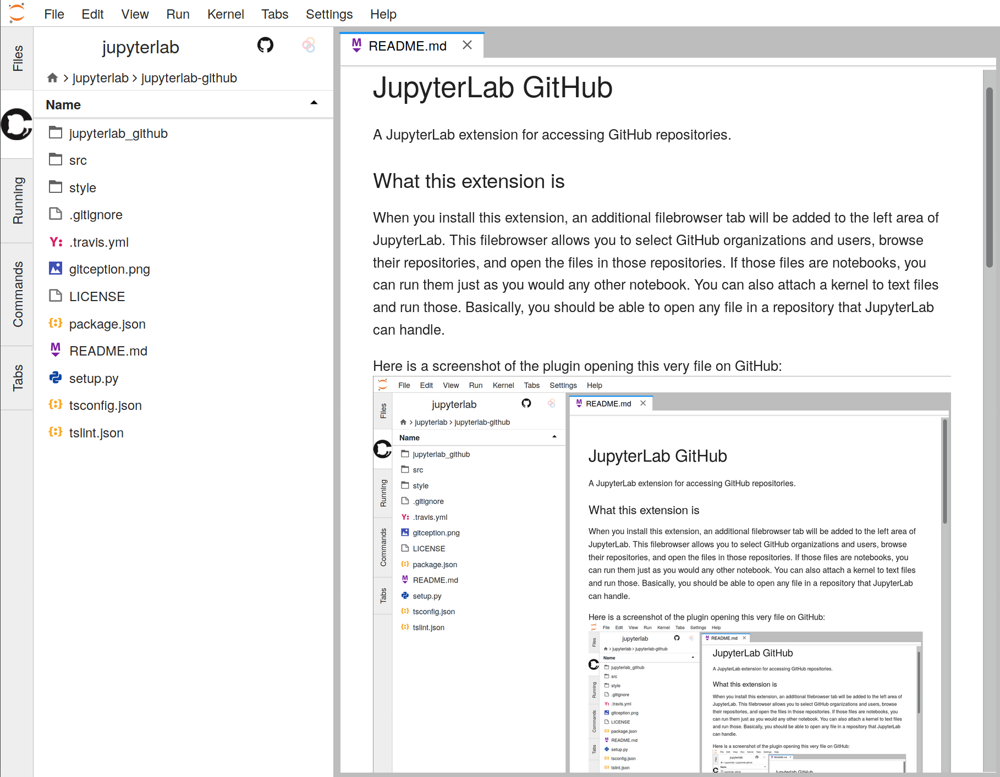

# Introduction

This document covers extensions and addons to **JupyterLab.** Extensions and addons covered:

*Note these extensions may only work in Lab and not Hub.*

- [Introduction](#introduction)
  - [Git](#git)
    - [Possible Errors](#possible-errors)
  - [GitHub](#github)
  - [Kernels](#kernels)
  - [Themes](#themes)

You may find more extensions online, but be aware of your JupyterLab version before installing them. Many extensions have not been updated since the first JupyterLab version, and need serious configuration in order to add them to the build list for Jupyter.

---

## Git

The git extension provides full git integration to a remote repository.


``` (bash)
jupyter labextension install @jupyterlab/git
pip install jupyterlab-git
jupyter serverextension enable --py jupyterlab_git --sys-prefix
```

* A server restart may be required.
* Read more about it [here](https://github.com/jupyterlab/jupyterlab-github).

### Possible Errors

JupyterLab may never register that you are in a git repository. To fix this, rerun the commands above, ensuring that the `--sys-prefix` flag is set.

JupyterLab also struggles with ssh keys - you may need to use the commandline to add a user's key the first time, as the `whoami` prompts interfere with the GUI.

---

## GitHub

The GitHub extension provides basic utilities of accessing git repositories.


**This is not an extension that provides full git integration. (See the git extension.)**

To install this extension, run the following command

``` (bash)
jupyter labextension install @jupyterlab/github #installs the labextension
pip install jupyterlab_github #install the server extension
jupyter serverextension enable --sys-prefix jupyterlab_github
```

* Read more about it [here](https://github.com/jupyterlab/jupyterlab-github).

---

## Kernels

Are you ready for a nightmare? Good we're not.
Use this website as a guide for kernels, but know that certain kernels do not play nicely with one another.


---

## Themes